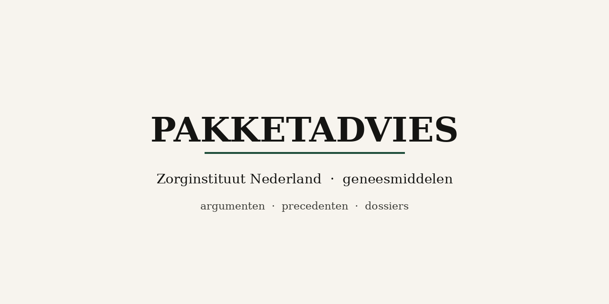

# Pakketadvies

Lokale citatie-tool voor **Zorginstituut Nederland (ZIN)** pakketadviezen over
geneesmiddelen.

**Voor wie:** mensen die een vergoedingsdossier schrijven (market access) en een
ZIN-precedent nodig hebben — welk argument, welk dossier, welke datum.

**Succes:** je hergebruikt een geciteerd argument zonder de Excel te openen en
zonder iets te installeren.

---

## Path A — Jij (niet technisch)

1. Kopieer: **https://github.com/berendgort/pakketadvies**
2. Plak die link in Cursor, Claude, ChatGPT met code, Copilot, …
3. Vraag in gewone taal, bijvoorbeeld:
   *zoek wanneer ZIN voor het eerst een extern controlecohort accepteerde*
4. Lees het antwoord: eerst het oordeel, dan dossier en datum

Jij installeert **geen** Python, opent **geen** terminal en **geen** spreadsheet.
De AI doet dat. Meer: [docs/for-humans.md](docs/for-humans.md).

---

## Path B — AI (every session)

```bash
./pakket instruct --json
./pakket cite "<query>" --json
```

- You own the runtime: prefer `./pakket` in this repo; if Python is missing,
  install it yourself — never ask the human.
- Narrate `data.verdict` first (`cite` / `thin` / `none` / `ambiguous`).
- Never scrape zorginstituutnederland.nl, never open the xlsx to answer, never
  invent dates / ICERs / budget figures.
- Full contract: [AGENTS.md](AGENTS.md). If a skill disagrees with `instruct`,
  trust `instruct`.

---

## What you get back

Verdict first, then dossier id, advice date, and the precedent sentence.
Shortlist stays in the JSON so later reversals stay visible.

Example: `./pakket cite "extern controlecohort" --json` → lead with verdict,
then the earliest decisive hit.

---

## What’s in the database

Stand as_of 2026-09-24 (context, not a todo):

| Dekking | Stand |
|---|---|
| Intramuraal | 174 dossiers, 163 argumenten volledig |
| GVS | 315 dossiers, 260 argumenten volledig, 27 basisgegevens |
| Argumentrijen | **1.372** (776 INT, 596 GVS) |
| Bronnen | GVS PDF-delen + tekstextracten + INT-bundles |

Een ander agentschap is later een map onder `data/`, niet een andere CLI.
Paraphrases zijn geen citaten van ZIN.

---

## Maintainers only

Nieuwe zips: `assets/drop/` → `python scripts/ingest_assets.py`.
Layout: [docs/source-data.md](docs/source-data.md) · [assets/README.md](assets/README.md).
